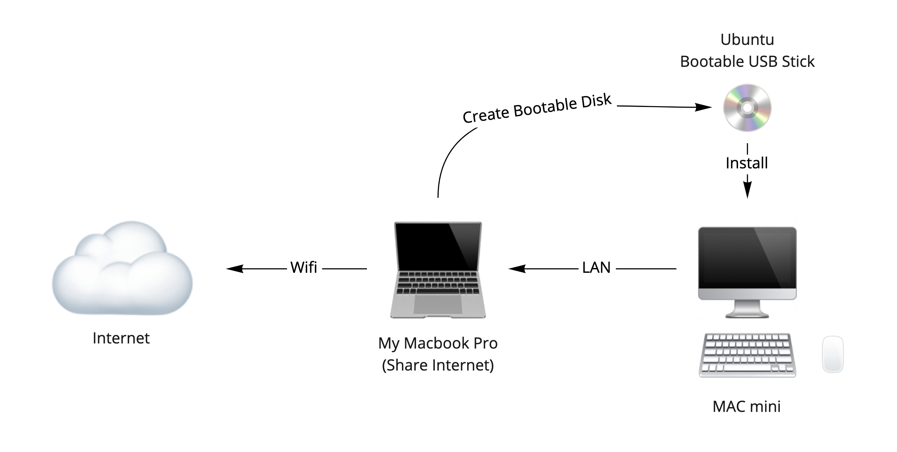

# Install Ubuntu

## Overviews

ด้วยการสร้าง Kubernetes Cluster ด้วย Mac-Mini ของผม ต้องการเอา Mac-Mini มาติดตั้ง Ubuntu Server และ ใช้ Wifi เพื่อเชื่อมต่อ สร้างเป็นเครื่อข่าย และให้สามารถต่อไปยัง Internet ได้ สิ่งแรกที่ต้องทำคือ การติดตั้ง Ubuntu Server ลงไปยังเครื่องที่มีอยู่ โดยปกติแล้ว Ubuntu Server จะไม่ได้ ใส่ Wireless Package มาด้วย (เช่น WPA Suppliment - ใช้ส่ง Password ไปยัง Access Point) จึงจะต้อง ติดตั้ง Ubuntu Server ให้เรียบร้อยซะก่อน แล้วถึงจะติดตั้ง Package เสริมอื่น ๆ ที่ต้องการเสริมเข้าไป เพื่อให้ใช้ Wifi ได้ ซึ่งในระหว่างนั้น ผมจึงให้ Mac-Mini ของผมออก Internet ผ่านสาย Lan ปกติ (ผมต่อผ่าน Mac Book ของผมอีกที) เพราะฉะนั้น เครื่องไม้เครื่องมือที่ผมใช้ในการติดตั้ง จึงออกมาดังภาพ

### Pre-require

- LAN Internet: เพื่อให้ Mac-Mini สามารถใช้ในการไป  Download  Package ต่าง ๆ ได้ (ในกรณีของผมใช้ Share ผ่าน Macbook Pro)
- LAN Cable: เชื่อมต่อกับ Mac-Mini กับ Network
- USB Stick: ใช้ในการสร้าง Ubuntu Installer Bootable Disk

### Installation

- [Manual Install into Mac-Mini](./manual.md)
- [Automatic Installation for Ubuntu 20.04](./automatic-install/)
