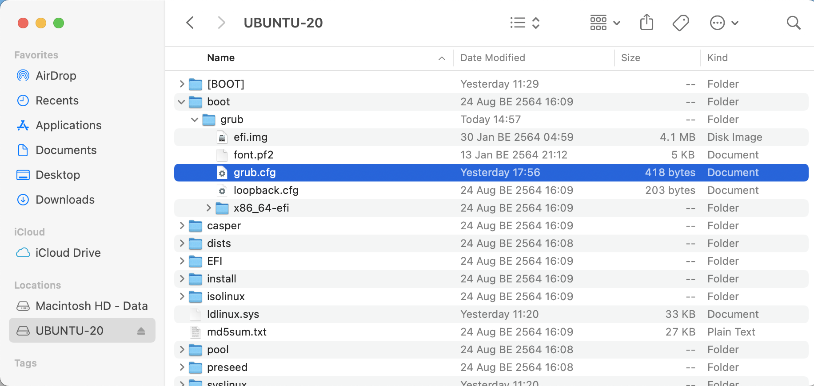
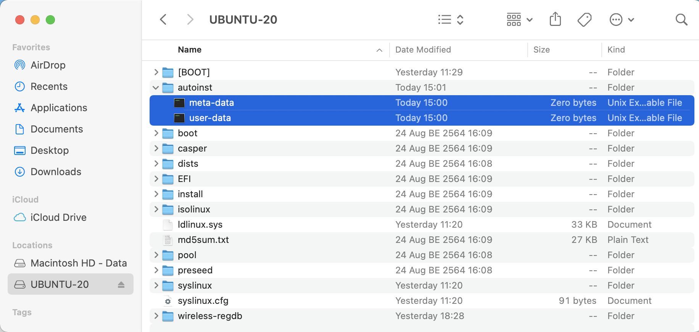

# Automatic Installation for Ubuntu 20.04

เนื่องจากผมต้องติดตั้ง Ubuntu Server ลงบน MAC-mini ที่ผมมีทั้ง 7 เครื่อง แถมอาจจะต้อง ล้างเครื่องลงใหม่บ่อย ๆ เพื่อให้สามารถทดลอง Cluster ได้ในหลาย ๆ รูปแบบ และใช้เวลาในการ Install Ubuntu ให้สั้นที่สุด ลดปัญหาจากการกรอกข้อมูลแบบ Manual ให้มาที่สุด แล้วผมก็เจอวิธีการที่สามารถทำได้อยู่ 2 วิธี คือ การใช้ [preseed](https://help.ubuntu.com/lts/installation-guide/s390x/apb.html) และ การใช้ [Automated Server Installs](https://ubuntu.com/server/docs/install/autoinstall) (สำหรับ Ubuntu Server 20.04 ขึ้นไป) จากที่ลองศึกษาดู ถึงแม้ว่า Automated Server Installs พึ่งมาใน Version ล่าสุด แต่ก็เป็นวิธีการที่น่าสนใจ ผมเลยจะลองใช้กับ Project นี้

## Table of Contents

- [Automatic Installation for Ubuntu 20.04](#automatic-installation-for-ubuntu-2004)
  - [Table of Contents](#table-of-contents)
  - [Create Ubuntu Installer Boot Stick with UUByte ISO Editor](#create-ubuntu-installer-boot-stick-with-uubyte-iso-editor)
  - [Setup Automatic Installs to Boot Stick](#setup-automatic-installs-to-boot-stick)
  - [Install Ubuntu Server](#install-ubuntu-server)
  - [Setup Wireless Network](#setup-wireless-network)
  - [Reference](#reference)

## Create Ubuntu Installer Boot Stick with UUByte ISO Editor

เนื่องจากการสร้าง Automatic Installer Boot Stick จำเป็นจะต้องมีการแก้ไข File ที่อยู่ใน ฺUSB Boot Stick ด้วย ซึ่งถ้าใช้ขั้นตอน แบบเดียวกับ [Create a bootable USB stick on macOS](https://ubuntu.com/tutorials/create-a-usb-stick-on-macos) ที่อยู่ใน Official Site ของ Ubuntu เอง จะไม่สามารถเข้าไปแก้ File ใน USB Boot Stick ได้ (เข้าใจว่าเป็นเพราะ Type of Partition ที่ Tools มันใช้ ตัว MacOS ไม่สามารถเปิดได้) ผมจึงหันมาใช้เครื่องมือตัวอื่นแทน แต่ด้วยความรู้อันน้อยนิด เกี่ยวกับ Ubuntu Boot Image เลยจบที่ ยอมจ่ายเงินซื้อ Tools ตัวนึงที่ชื่อ [UUByte ISO Editor](https://www.uubyte.com/iso-editor.html)

ขั้นตอนคร่าว ๆ ของการสร้าง Boot Stick ก็มีดังนี้

- เข้า Program [UUByte ISO Editor](https://www.uubyte.com/iso-editor.html) (ผมไม่ได้เป็น Sale ขายตัวนี้นะครับ)

  

- กดปุ่ม Burn

  

- เลือก ISO Images File ที่ Download ไว้, กำหนดเป็น Create A Bootable USB, เลือก Drive, Partition Type, File System = FAT32  และกำหนดชื่อ Volume Lable = UBUNTU-20

  

- สั่ง Burn รอจนเสร็จ กด OK แล้วลองตรวจสอบ USB Drive ของเราจะเห็น Folder ประมาณนี้

  

## Setup Automatic Installs to Boot Stick

ด้วย [Automated Server Installs](https://ubuntu.com/server/docs/install/autoinstall) ใช้วิธีการกำหนดรายละเอียดของ Server ที่จะทำการติดตั้ง ผ่านไฟล์ที่ชื่อ user-data และ meta-data และเพื่อให้ ฺBoot Loader เข้ามาอ่าน File ดังกล่าว จำเป็นจะต้อง เปลี่ยนวิธีการใน grub.conf  เพื่อให้การติดตั้งครั้งนี้ เป็นการติดตั้งแบบ Automatic โดยไม่ต้องมี User เข้ามากรอกข้อมูลเลย โดยวิธีการคร่าว ๆ ของ การ Boot USB Drive เพื่อ Install เป็นดังภาพ


เพื่อให้สามารถทำงานได้ดังภาพ เราจำเป็นจะต้อง Setup Boot Stick ของเราดังนี้

- แก้ไข File grub.conf เพื่อให้ใช้ Automatic Installs

  1. เปิด file /boot/grub/grub.conf

     

     ```config
     if loadfont /boot/grub/font.pf2 ; then
         set gfxmode=auto
         insmod efi_gop
         insmod efi_uga
         insmod gfxterm
         terminal_output gfxterm
     fi

     set menu_color_normal=white/black
     set menu_color_highlight=black/light-gray

     set timeout=5
     menuentry "Install Ubuntu Server" {
         set gfxpayload=keep
         linux /casper/vmlinuz   quiet  ---
         initrd /casper/initrd
     }
     grub_platform
     if [ "$grub_platform" = "efi" ]; then
     menuentry 'Boot from next volume' {
         exit 1
     }
     menuentry 'UEFI Firmware Settings' {
         fwsetup
     }
     fi
     submenu 'Boot and Install with the HWE kernel' {
     menuentry "Install Ubuntu Server" {
         set gfxpayload=keep
         linux /casper/hwe-vmlinuz   quiet  ---
         initrd /casper/hwe-initrd
     }
     }
     ```

  2. มองหา `menuentry` ที่ใช้เพื่อ `Install Ubuntu Server`

     ```conf
     set timeout=5
     menuentry "Install Ubuntu Server" {
         set gfxpayload=keep
         linux /casper/vmlinuz   quiet  ---
         initrd /casper/initrd
     } 
     ```

  3. ปรับ Config ให้ไปใช้ Automatic Installs โดย ปรับแก้ที่บรรทัด ที่ขึ้นต้นด้วย `linux /casper/vmlinuz`

     ```config
     set timeout=5
     menuentry "Install Ubuntu Server" {
         set gfxpayload=keep
         linux /casper/vmlinuz    autoinstall ds=nocloud\;seedfrom=file://cdrom/autoinst/  fsck.mode=skip quiet   ---
         initrd /casper/initrd
     }
     ```

     รายละเอียดที่เพิ่มเข้าไป
     - `autoinstall` - ให้ปรับ Mode การ Install ให้เป็น Automatic Installs
     - `ds=nocloud\;` - Configuration Datasource (ไฟล์ user-data, meta-data) ให้เอาจาก File System (ถ้าให้เอาจาก Server ให้เปลี่ยนเป็น `ds=nocloud-net\;`)
     - `seedfrom=file://cdrom/autoinst/` - Configuration Datasource เก็บอยู่ใน `/cdrom/autoinst` (bootloader มอง USB Stick ว่าอยู่ใน `/cdrom`) ซึ่งเดี๋ยวเราจะสร้าง Folder `/autoinst` ไว้ใน USB Stick
     - `fsck.mode=skip` - บอก Installer ว่าไม่ต้องเช็ค Integrity ไฟล์ เพราะเรามีการแก้ไข แบบ Manual ไป

  4. Save File grub.conf

  หมายเหตุ: ตัวอย่างของ `grub.conf` สามารถดูได้จาก [./boot/grub/grub.conf](./boot/grub/grub.cfg) ใน Repo นี้

- สร้าง File Automatic Installs Config
  
  1. สร้าง File `user-data` และ `meta-data` ใน `/autoinst` ของ USB Stick

     
  
  2. เปิด File `/autoinst/user-data` เพื่อกำหนดรายละเอียดของการ Install

  3. ระบุ Hostname, Username และ Password ทีใช้ในการ Login ในกรณีนี้ ผมจะใช้ Default ของ Ubuntu เป็น `hostname=ubuntu-server`, `username=ubuntu` และ `password=ubuntu`

     ```yaml
     #cloud-config
     autoinstall:
     version: 1
     identity:
       hostname: ubuntu-server
       username: ubuntu
       password: "$6$exDY1mhS4KUYCE/2$zmn9ToZwTKLhCw.b4/b.ZRTIZM30JZ4QrOQ2aOXJ8yk96xpcCof0kxKwuX1kqLG/ygbJ1f8wxED22bTL4F46P0"
     ```

     หมายเหตุ: password เป็น `ubuntu` แต่เวลาใส่ใน File Config ต้องสร้างเป็น SHA-512 ก่อนดูรายละเอียดได้ที่ [Generate SHA-512 for Password](./generate-sha512.md)

  4. กำหนดให้ Install SSH-Server เพื่อให้เราสามารถ Connect Server ของเราผ่าน ssh protocal ได้

     ```yaml
     ssh:
       install-server: true
       authorized-keys:
         - ${SSH-PUBLIC-KEY}
       allow-pw: no
     ```

     หมายเหตุ: `${SSH-PUBLIC-KEY}` ใช้เพื่อให้เราสามารถ Secure Shell ไปที่ Server โดยไม่ต้องใช้ Password สามารถสร้างได้จาก `ssh-keygen` และปกติจะอยู่ใน `~/.ssh/id_rsa.pub`

  5. กำหนดรายละเอียดของ `storage` และ `network` ซึ่งในกรณีของผมจะให้อ่าน ip จาก dhcp นะครับ แต่ก็สามารถระบุ ip ได้เลย โดยดูรายละเอียดเพิ่มเติมได้จาก [Netplan configuration examples](https://netplan.io/examples/)

     ```yaml
     storage:
       layout:
         name: lvm
     network:
       network:
         version: 2
         ethernets:
           enp3s0f0:
             dhcp4: yes
             optional: yes
           wlp2s0:
             dhcp4: yes
             optional: yes
     ```

     หมายเหตุ: `optional: yes` ใช้เพื่อลดเวลาตอน Boot Server ให้ไม่ต้องรอจน Network Start เสร็จ ก่อนถึงจะไป Step ต่อไป

  6. นอกจากนั้น เรายังสั่งให้ Installer สามารถ Install Package ที่เราต้องการได้จาก Config นี้เลย (จำเป็นต่้องต่อ Internet ในการ Install)

     ```yaml
     packages:
       - net-tools 
       - wireless-tools
       - network-manager
       - wpasupplicant
       - bcmwl-kernel-source
     ```

     หมายเหตุ: รายการ Package นี้ ได้มาจากสิ่งที่ต้อง Install แบบ Manual ใน [Manual Install into Mac-Mini](../manual.md)

  7. สรุป หน้าตาของ File user-data ที่เราจะใช้สำหรับการ Install แบบ Automatic สามารถดูตัวอย่างได้ที่ [./autoinst/user-data](./autoinst/user-data)

     ```yaml
     #cloud-config
     autoinstall:
     version: 1
     identity:
       hostname: ubuntu-server
       username: ubuntu
       password: "$6$exDY1mhS4KUYCE/2$zmn9ToZwTKLhCw.b4/b.ZRTIZM30JZ4QrOQ2aOXJ8yk96xpcCof0kxKwuX1kqLG/ygbJ1f8wxED22bTL4F46P0"
     ssh:
       install-server: true
       authorized-keys:
         - ${SSH-PUBLIC-KEY}
       allow-pw: no
     storage:
       layout:
         name: lvm
     network:
       network:
         version: 2
         ethernets:
           enp3s0f0:
             dhcp4: yes
             optional: yes
           wlp2s0:
             dhcp4: yes
             optional: yes
     packages:
       - net-tools 
       - wireless-tools
       - network-manager
       - wpasupplicant
       - bcmwl-kernel-source
     ```

## Install Ubuntu Server

   ขั้นตอนนี้แค่เสียบ USB เข้าไปใน Mac-Mini แล้ว แล้วตอนเปิดเครื่องให้กดปุ่ม `option` ค้างไว้ จนกว่าจะแสดงหน้าจอตามรูป ให้เลือก `EFI Boot` ที่เป็นสัญลักษณ์ USB (เครื่องผมเป็นสีเหลือง ๆ ตามรูป)

   

   หลังจาก Install เสร็จ ให้เอา USB ออกแล้ว Restart เครื่องก็จะได้ Ubuntu Server บน Mac-mini ของเราแล้ว

## Setup Wireless Network

- Disable NetworkManager

  1. Stop Network Manager with the following command

     ```shell
     sudo systemctl stop NetworkManager
     ```

  2. Disable NetworkManager auto-start at boot time by executing the following command.

     ```shell
     sudo systemctl disable NetworkManager-wait-online NetworkManager-dispatcher NetworkManager
     ```

     ```shell
     Removed /etc/systemd/system/dbus-org.freedesktop.nm-dispatcher.service.
     Removed /etc/systemd/system/multi-user.target.wants/NetworkManager.service.
     Removed /etc/systemd/system/network-online.target.wants/NetworkManager-wait-online.service.
     ```

- Config WPA Supplicant
  
  1. We need to create a file named `wpa_supplicant.conf` using the `wpa_passphrase` utility. `wpa_supplicant.conf` is the configuration file describing all networks that the user wants the computer to connect to. Run the following command to create this file. Replace ESSID and Wi-Fi passphrase with your own.

     ```shell
     wpa_passphrase ${your-ESSID} ${your-wifi-passphrase} | sudo tee /etc/wpa_supplicant.conf
     ```

     ```shell
     network={
        ssid="${your-ESSID}"
        #psk="${your-wifi-passphrase}"
        psk=24f508ef2946032b65ed981fae766c657cff471945086abb55c9a02d09a4bf08
     }
     ```

  2. run WPA Supplicant in the background

     ```shell
     sudo wpa_supplicant -B -c /etc/wpa_supplicant.conf -i wlp2s0
     ```

     ```shell
     Successfully initialized wpa_supplicant
     ```

  3. run `iwconfig` to check wifi connection

     ```shell
     iwconfig
     ```

     ```shell
     wlp2s0    IEEE 802.11  ESSID:"${your-ESSID}"  
               Mode:Managed  Frequency:5.2 GHz  Access Point: 70:F8:2B:CF:C4:D5   
               Retry short limit:7   RTS thr:off   Fragment thr:off
               Power Management:off

     lo        no wireless extensions.

     enp3s0f0  no wireless extensions.
     ```

- Setup Auto-Connect to Wi-fi At Boot Time

  To automatically connect to wireless network at boot time, we need to edit the `wpa_supplicant.service` file. It’s a good idea to copy the file from `/lib/systemd/system/` directory to `/etc/systemd/system/` directory, then edit the file content, because we don’t want a newer version of wpa_supplicant to override our modifications.

  1. Copy `wpa_supplicant.service` from lib folder

     ```shell
     sudo cp /lib/systemd/system/wpa_supplicant.service /etc/systemd/system/wpa_supplicant.service
     ```

  2. Edit the file with a command-line text editor, such as VI, Nano.

     ```shell
     sudo vi /etc/systemd/system/wpa_supplicant.service
     ```

     Find the following line.

     ```properties
     [Unit]
     Description=WPA supplicant
     Before=network.target
     After=dbus.service
     Wants=network.target
     IgnoreOnIsolate=true

     [Service]
     Type=dbus
     BusName=fi.w1.wpa_supplicant1
     ExecStart=/sbin/wpa_supplicant -u -s -O /run/wpa_supplicant # <--- Line to be change

     [Install]
     WantedBy=multi-user.target
     Alias=dbus-fi.w1.wpa_supplicant1.service
     ```

  3. Change it to the following.
  
     Here we added the configuration file and the wireless interface name to the ExecStart command.

     ```properties
     ExecStart=/sbin/wpa_supplicant -u -s -c /etc/wpa_supplicant.conf -i wlp2s0
     ```

     It’s recommended to always try to restart wpa_supplicant when failure is detected. Add the following right below the ExecStart line.

     ```properties
     Restart=always
     ```

     If you can find the following line in this file, comment it out (Add the # character at the beginning of the line).

     ```properties
     Alias=dbus-fi.w1.wpa_supplicant1.service
     ```

     Save and close the file. Updated version should be

     ```properties
     [Unit]
     Description=WPA supplicant
     Before=network.target
     After=dbus.service
     Wants=network.target
     IgnoreOnIsolate=true
     
     [Service]
     Type=dbus
     BusName=fi.w1.wpa_supplicant1
     ExecStart=/sbin/wpa_supplicant -u -s -c /etc/wpa_supplicant.conf -i wlp2s0
     Restart=always

     [Install]
     WantedBy=multi-user.target
     #Alias=dbus-fi.w1.wpa_supplicant1.service
     ```

  4. Then reload systemd and Enable wpa_supplicant service to start at boot time.

     ```shell
     sudo systemctl daemon-reload
     ```

     Enable wpa_supplicant service to start at boot time.

     ```shell
     sudo systemctl enable wpa_supplicant.service
     ```

  5. Start dhclient at boot time to obtain a private IP address from DHCP server. This can be achieved by creating a systemd service unit for dhclient.

     Edit `dhclient.service`

     ```shell
     sudo vi /etc/systemd/system/dhclient.service
     ```

     Put the following text into the file.

     ```shell
     [Unit]
     Description= DHCP Client
     Before=network.target
     After=wpa_supplicant.service

     [Service]
     Type=forking
     ExecStart=/sbin/dhclient wlp2s0 -v
     ExecStop=/sbin/dhclient wlp2s0 -r
     Restart=always
     
     [Install]
     WantedBy=multi-user.target
     ```

     Save and close the file. Then enable this service.

     ```shell
     sudo systemctl enable dhclient.service
     ```

  6. Restart Ubuntu Server to Take effect

     ```shell
     sudo shutdown -r now
     ```

## Reference

- [Automated Server Installs - Introduction](https://ubuntu.com/server/docs/install/autoinstall)
- [Autoinstall Quick Start - Providing the autoinstall data over the network](https://ubuntu.com/server/docs/install/autoinstall-quickstart)
- [JSON Schema for autoinstall config](https://ubuntu.com/server/docs/install/autoinstall-schema)
- [Automated Server Install Quickstart - covertsh's comment](https://discourse.ubuntu.com/t/automated-server-install-quickstart/16614/28)
- [How do I install wpa-supplicant on an offline server?](https://askubuntu.com/questions/503397/how-do-i-install-wpa-supplicant-on-an-offline-server)
- [Ubuntu Server Netplan for Wifi and Ethernet](https://askubuntu.com/questions/1042789/ubuntu-server-netplan-for-wifi-and-ethernet)
- [Ubuntu Server 20.04 Autoinstall](https://superuser.com/questions/1556083/ubuntu-server-20-04-autoinstall)
