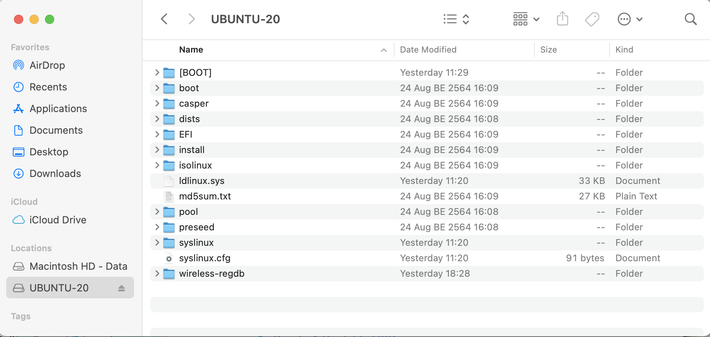

# Automatic Installation for Ubuntu 20.04

เนื่องจากผมต้องติดตั้ง Ubuntu Server ลงบน MAC-mini ที่ผมมีทั้ง 7 เครื่อง แถมอาจจะต้อง ล้างเครื่องลงใหม่บ่อย ๆ เพื่อให้สามารถทดลอง Cluster ได้ในหลาย ๆ รูปแบบ และใช้เวลาในการ Install Ubuntu ให้สั้นที่สุด ลดปัญหาจากการกรอกข้อมูลแบบ Manual ให้มาที่สุด แล้วผมก็เจอวิธีการที่สามารถทำได้อยู่ 2 วิธี คือ การใช้ [preseed](https://help.ubuntu.com/lts/installation-guide/s390x/apb.html) และ การใช้ [Automated Server Installs](https://ubuntu.com/server/docs/install/autoinstall) (สำหรับ Ubuntu Server 20.04 ขึ้นไป) จากที่ลองศึกษาดู ถึงแม้ว่า Automated Server Installs พึ่งมาใน Version ล่าสุด แต่ก็เป็นวิธีการที่น่าสนใจ ผมเลยจะลองใช้กับ Project นี้

## Table of Contents

- [Automatic Installation for Ubuntu 20.04](#automatic-installation-for-ubuntu-2004)
  - [Table of Contents](#table-of-contents)
  - [Create Ubuntu Installer Boot Stick with UUByte ISO Editor](#create-ubuntu-installer-boot-stick-with-uubyte-iso-editor)
  - [Setup Automatic Installs to Boot Stick](#setup-automatic-installs-to-boot-stick)
  - [Install Ubuntu Server](#install-ubuntu-server)
  - [Setup Wireless Network](#setup-wireless-network)
  - [Reference](#reference)

## Create Ubuntu Installer Boot Stick with UUByte ISO Editor

เนื่องจากการสร้าง Automatic Installer Boot Stick จำเป็นจะต้องมีการแก้ไข File ที่อยู่ใน ฺUSB Boot Stick ด้วย ซึ่งถ้าใช้ขั้นตอน แบบเดียวกับ [Create a bootable USB stick on macOS](https://ubuntu.com/tutorials/create-a-usb-stick-on-macos) ที่อยู่ใน Official Site ของ Ubuntu เอง จะไม่สามารถเข้าไปแก้ File ใน USB Boot Stick ได้ (เข้าใจว่าเป็นเพราะ Type of Partition ที่ Tools มันใช้ ตัว MacOS ไม่สามารถเปิดได้) ผมจึงหันมาใช้เครื่องมือตัวอื่นแทน แต่ด้วยความรู้อันน้อยนิด เกี่ยวกับ Ubuntu Boot Image เลยจบที่ ยอมจ่ายเงินซื้อ Tools ตัวนึงที่ชื่อ [UUByte ISO Editor](https://www.uubyte.com/iso-editor.html)

ขั้นตอนคร่าว ๆ ของการสร้าง Boot Stick ก็มีดังนี้

- เข้า Program [UUByte ISO Editor](https://www.uubyte.com/iso-editor.html) (ผมไม่ได้เป็น Sale ขายตัวนี้นะครับ)

  

- กดปุ่ม Burn

  

- เลือก ISO Images File ที่ Download ไว้, กำหนดเป็น Create A Bootable USB, เลือก Drive, Partition Type, File System = FAT32  และกำหนดชื่อ Volume Lable = UBUNTU-20

  

- สั่ง Burn รอจนเสร็จ กด OK แล้วลองตรวจสอบ USB Drive ของเราจะเห็น Folder ประมาณนี้

  

## Setup Automatic Installs to Boot Stick

ด้วย [Automated Server Installs](https://ubuntu.com/server/docs/install/autoinstall) ใช้วิธีการกำหนดรายละเอียดของ Server ที่จะทำการติดตั้ง ผ่านไฟล์ที่ชื่อ user-data และ meta-data และเพื่อให้ ฺBoot Loader เข้ามาอ่าน File ดังกล่าว จำเป็นจะต้อง เปลี่ยนวิธีการใน grub.conf  เพื่อให้การติดตั้งครั้งนี้ เป็นการติดตั้งแบบ Automatic โดยไม่ต้องมี User เข้ามากรอกข้อมูลเลย โดยวิธีการคร่าว ๆ ของ การ Boot USB Drive เพื่อ Install เป็นดังภาพ


เพื่อให้สามารถทำงานได้ดังภาพ เราจำเป็นจะต้อง Setup Boot Stick ของเราดังนี้

- แก้ไข File grub.conf เพื่อให้ใช้ Automatic Installs

  1. เปิด file /boot/grub/grub.conf

     ```config
     if loadfont /boot/grub/font.pf2 ; then
         set gfxmode=auto
         insmod efi_gop
         insmod efi_uga
         insmod gfxterm
         terminal_output gfxterm
     fi

     set menu_color_normal=white/black
     set menu_color_highlight=black/light-gray

     set timeout=5
     menuentry "Install Ubuntu Server" {
         set gfxpayload=keep
         linux /casper/vmlinuz   quiet  ---
         initrd /casper/initrd
     }
     grub_platform
     if [ "$grub_platform" = "efi" ]; then
     menuentry 'Boot from next volume' {
         exit 1
     }
     menuentry 'UEFI Firmware Settings' {
         fwsetup
     }
     fi
     submenu 'Boot and Install with the HWE kernel' {
     menuentry "Install Ubuntu Server" {
         set gfxpayload=keep
         linux /casper/hwe-vmlinuz   quiet  ---
         initrd /casper/hwe-initrd
     }
     }
     ```

  2. มองหา `menuentry` ที่ใช้เพื่อ `Install Ubuntu Server`

     ```conf
     set timeout=5
     menuentry "Install Ubuntu Server" {
         set gfxpayload=keep
         linux /casper/vmlinuz   quiet  ---
         initrd /casper/initrd
     } 
     ```

  3. ปรับ Config ให้ไปใช้ Automatic Installs โดย ปรับแก้ที่บรรทัด ที่ขึ้นต้นด้วย `linux /casper/vmlinuz`

     ```config
     set timeout=5
     menuentry "Install Ubuntu Server" {
         set gfxpayload=keep
         linux /casper/vmlinuz    autoinstall ds=nocloud\;seedfrom=file://cdrom/autoinst/  fsck.mode=skip quiet   ---
         initrd /casper/initrd
     }
     ```

     รายละเอียดที่เพิ่มเข้าไป
     - `autoinstall` - ให้ปรับ Mode การ Install ให้เป็น Automatic Installs
     - `ds=nocloud\;` - Configuration Datasource (ไฟล์ user-data, meta-data) ให้เอาจาก File System (ถ้าให้เอาจาก Server ให้เปลี่ยนเป็น `ds=nocloud-net\;`)
     - `seedfrom=file://cdrom/autoinst/` - Configuration Datasource เก็บอยู่ใน `/cdrom/autoinst` (bootloader มอง USB Stick ว่าอยู่ใน `/cdrom`) ซึ่งเดี๋ยวเราจะสร้าง Folder `/autoinst` ไว้ใน USB Stick
     - `fsck.mode=skip` - บอก Installer ว่าไม่ต้องเช็ค Integrity ไฟล์ เพราะเรามีการแก้ไข แบบ Manual ไป

  4. Save File grub.conf

  หมายเหตุ: ตัวอย่างของ `grub.conf` สามารถดูได้จาก [./boot/grub/grub.conf](./boot/grub/grub.cfg) ใน Repo นี้

## Install Ubuntu Server

## Setup Wireless Network

## Reference

- [Automated Server Installs - Introduction](https://ubuntu.com/server/docs/install/autoinstall)
- [Autoinstall Quick Start - Providing the autoinstall data over the network](https://ubuntu.com/server/docs/install/autoinstall-quickstart)
- [JSON Schema for autoinstall config](https://ubuntu.com/server/docs/install/autoinstall-schema)
- [Automated Server Install Quickstart - covertsh's comment](https://discourse.ubuntu.com/t/automated-server-install-quickstart/16614/28)
- [How do I install wpa-supplicant on an offline server?](https://askubuntu.com/questions/503397/how-do-i-install-wpa-supplicant-on-an-offline-server)
- [Ubuntu Server Netplan for Wifi and Ethernet](https://askubuntu.com/questions/1042789/ubuntu-server-netplan-for-wifi-and-ethernet)
